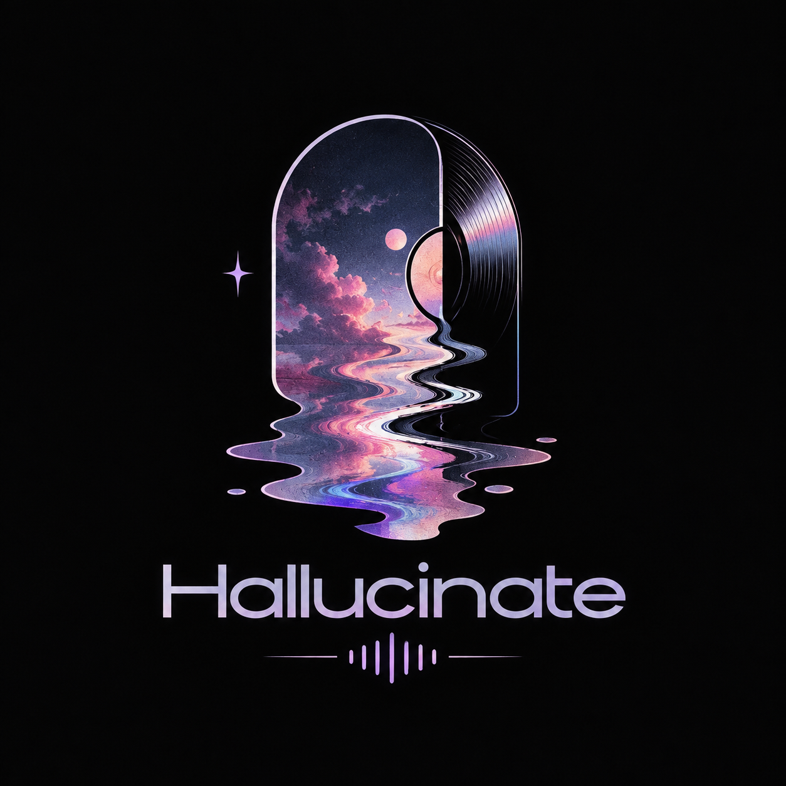
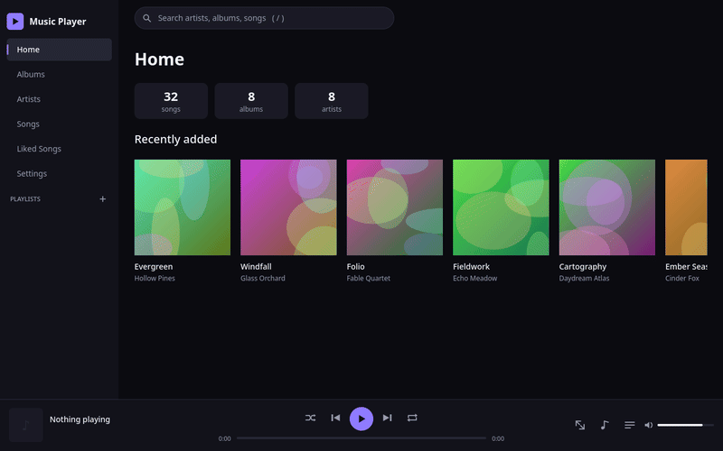
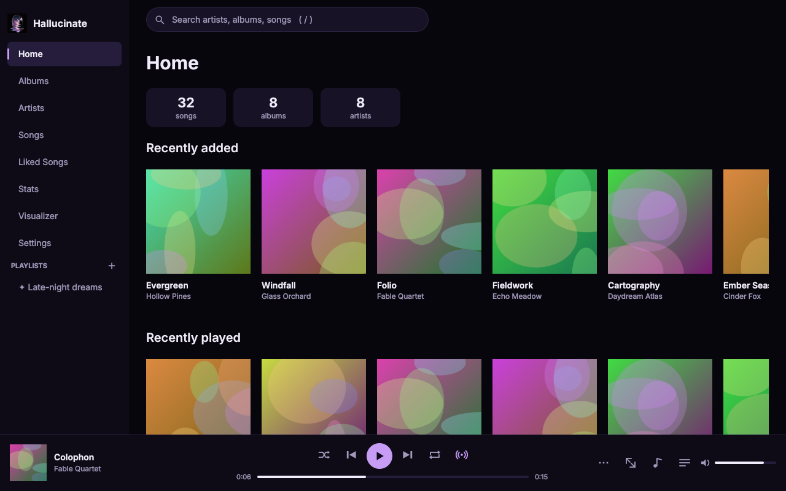
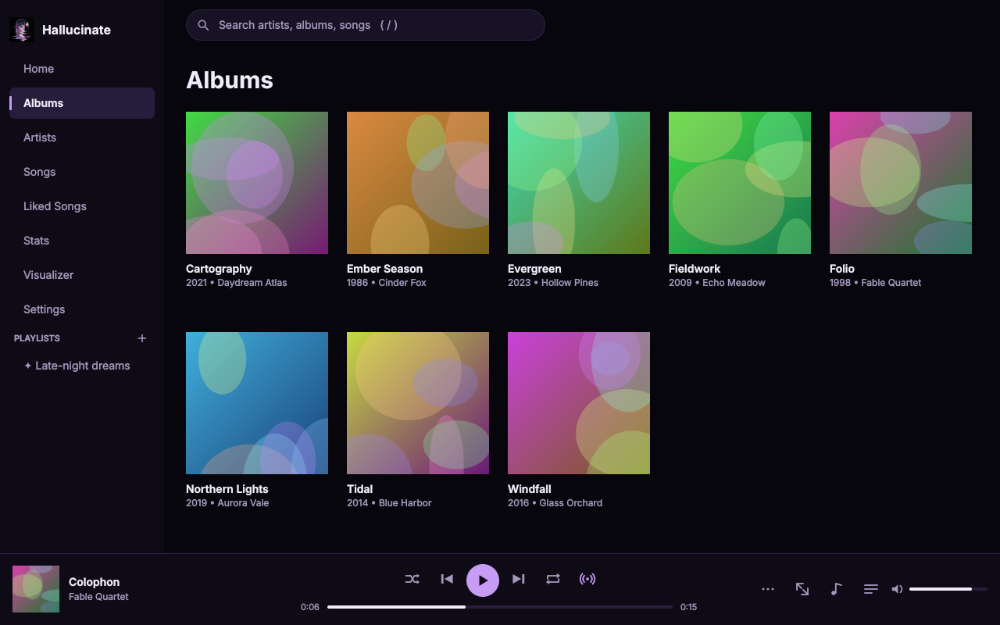
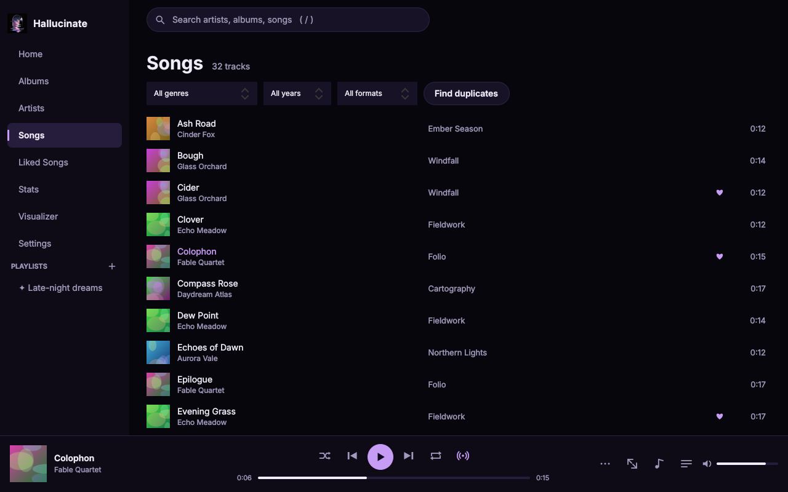
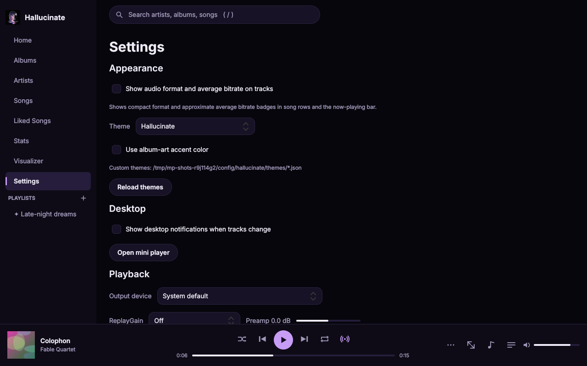

<p align="center">
  
</p>

<h1 align="center">Hallucinate</h1>

[](https://github.com/bulmaspanties/Hallucinate/actions/workflows/ci.yml)
[](LICENSE)


A fast, modern desktop music player (PySide6 + QML) for Linux (other
OSes secondary) with a Spotify-style search-and-browse experience. Not
playlist-driven: type to find, click to play.

## Screenshots


| Home | Albums |
|---|---|
|  |  |
| Songs | Settings |
|  |  |

_Screenshots are rendered offscreen from a synthetic library: `python scripts/screenshots.py docs/screenshots [--scale 2]`._

## Features
- Scans folders (mutagen tags + embedded/folder cover art) into SQLite with FTS5 instant search; incremental rescans (mtime/size), background scanning, file watching, and removal of moved/deleted paths.
- Formats: FLAC, MP3, OGG/Vorbis, Opus, WAV, AAC/M4A, ALAC, WMA, APE, WavPack, AIFF and more (anything Qt's FFmpeg backend decodes). WAV/AIFF RIFF/FORM text tags are read; missing tags fall back to the filename and unknown values.
- Global search grouped into Artists / Albums / Songs; Home, Albums, Artists, Songs browse views; album and artist pages; editable queue; shuffle/repeat; seek; volume. Queue, current position, shuffle, repeat, and volume are restored after restart; missing queue files are discarded.
- Drag audio files or folders onto the window to play them (onto the queue panel to append); files outside the library play straight from their tags. Save the queue as a playlist from the queue panel.
- Radio mode (the broadcast button next to repeat): when the queue is about to run out, similar songs from your library are added so playback keeps going. Picks are based on what you have listened to alongside the recent tracks, their artists, genres and years, with liked and often-played songs slightly favoured, recently played songs held back, and at most two songs per artist in each batch. Radio pauses while repeat is on.
- Choose the audio output device in Settings → Playback; the choice is remembered, and if that device is unplugged playback moves to the system default until it returns.
- MPRIS2 controls and media keys on Linux.
- CLI controls (`hallucinate --next`, `--prev`, `--play-pause`) and JSON playback status (`--status`) through per-user single-instance IPC; optional desktop notifications on track changes.
- Optional Last.fm account linking, now-playing updates, 50%-or-four-minutes
  scrobbling, secure system-keyring credentials, and a persistent offline retry queue.
- Liked Songs and user playlists (create, rename, delete, add from any track's "…" menu); Home shows Recently played, Most played, and a listening-based personal mix.
- A Stats page with top artists/albums/tracks and listening time for all time, the last 7 days, 30 days, or 12 months. Listening time is estimated from known track durations.
- Filter the library by genre, year, and format; find probable duplicate tracks by normalized title, artist, and duration. Manage multiple library folders in Settings.
- ReplayGain (track/album, preamp, read from tags), optional crossfade (0–12 s), gapless playback that plays every track to its last sample, and a 10-band equalizer with presets (needs numpy).
- Optional 24-band spectrum visualizer with a dedicated page; FFT analysis runs on a worker thread and the on/off preference persists.
- Optional compact format/average-bitrate badges in track rows and the now-playing bar (Settings → Appearance); the display is off by default, shows approximate average kb/s, and leaves unavailable bitrates out rather than displaying zero.
- Tag editor (single track or whole album; MP3, FLAC, Ogg/Opus, M4A, WMA, APE) and cover art: set from an image file, fetch from MusicBrainz / Cover Art Archive, optionally embed in files.
- Lyrics panel with synced highlighting: embedded tags, sidecar `.lrc`, or LRCLIB (cached locally; can be disabled).
- Mini player (always-on-top, `Ctrl+M`) and a system tray icon with play/pause/next/previous, optional close-to-tray.
- Keyboard focus rings and screen-reader names on buttons, rows and cards; renders crisply on HiDPI (tested at 2x).
- Live-switchable, file-backed themes with album-art accent mode and keyboard-friendly UI.

## Install
### AUR — **not yet published to AUR**
PKGBUILDs for `hallucinate` (latest release) and `hallucinate-git` (`main`) are in `packaging/aur/`; CI
builds, lints and launches the stable package in an Arch container. Until they are submitted, build locally:
```sh
cd packaging/aur/hallucinate && makepkg -si       # or packaging/aur/hallucinate-git
```
Maintainer and submission notes: [packaging/aur/README.md](packaging/aur/README.md).

### Windows
Download `hallucinate-*-windows-x64-setup.exe` (installer) or `hallucinate-*-windows-x64.zip` (portable; run `Hallucinate\Hallucinate.exe`) from [Releases](https://github.com/bulmaspanties/Hallucinate/releases). Built with PyInstaller (`packaging/windows/build.ps1`). Unsigned, so SmartScreen may warn. MPRIS is Linux-only; Last.fm credentials use Windows Credential Manager; data lives in `%APPDATA%\hallucinate`.

### AppImage (any x86_64 Linux)
Download `hallucinate-*-x86_64.AppImage` from the [Releases](https://github.com/bulmaspanties/Hallucinate/releases) page:
```sh
chmod +x hallucinate-*.AppImage && ./hallucinate-*.AppImage
```
Bundles Python, PySide6 and the Qt Multimedia FFmpeg backend. Build it yourself with `packaging/appimage/build.sh`.

### Flatpak (Flathub-ready manifest; not yet on Flathub)
The manifest uses the KDE runtime with Flathub's PySide BaseApp and builds offline with pinned
dependencies. Build and install locally with Flatpak Builder:
```sh
flatpak-builder --user --install --force-clean build-dir \
  packaging/flatpak/io.github.bulmaspanties.Hallucinate.yml \
  --install-deps-from=flathub
flatpak run io.github.bulmaspanties.Hallucinate
```
The sandbox grants read-only access to `~/Music`; use the folder picker portal
to grant access to other music directories. Flathub submission steps:
[packaging/flatpak/README.md](packaging/flatpak/README.md).

### macOS
The release workflow builds a self-contained `.app` zip for the runner's native
architecture. Download `hallucinate-*-macos-*.zip` from [Releases](https://github.com/bulmaspanties/Hallucinate/releases),
unzip it, and move `Hallucinate.app` to Applications. The build is unsigned and
not notarized, so Gatekeeper may require explicit approval. Build locally on a
Mac with `packaging/macos/build.sh`.

### Arch Linux
```sh
sudo pacman -S pyside6 python-mutagen python-keyring python-numpy qt6-multimedia-ffmpeg
git clone https://github.com/bulmaspanties/Hallucinate.git && cd Hallucinate
cd packaging/aur/hallucinate && makepkg -si      # or run from source (below)
```
### pip (any OS)
```sh
python -m venv .venv && . .venv/bin/activate
pip install -e '.[test]'
```
Note: a distro `pyside6` must match the installed Qt version; if you see
`undefined symbol` import errors, use an isolated venv (no system site packages)
so pip installs the PySide6 wheel.
Hallucinate requires PySide6/Qt 6.11.2 or newer (6.8 added the audio-buffer processing used
by the equalizer and spectrum visualizer).

## Run
```sh
hallucinate                 # uses ~/Music on first run
hallucinate ~/Music /mnt/flac   # add folders
python -m hallucinate ~/Music
```
Folders can also be managed in Settings. Data lives in `~/.local/share/hallucinate`
(override with `HALLUCINATE_DATA`). On first launch, existing Music Player
library, settings, cache, themes, playlists, playback preferences, and Last.fm
keyring credentials are migrated without replacing data already at the new path.

## Performance

Scanning, database reads/writes, search and cover decoding all run off the GUI thread; lists and grids are
virtualized and thumbnails are cached under the data directory. `tests/test_performance.py` exercises a 50k-track
library and asserts the UI thread is never blocked for long.

## Last.fm
In Settings, enter the API key and secret for a Last.fm API application (create
one at [last.fm/api/account/create](https://www.last.fm/api/account/create)).
Credentials and the resulting account session are saved only through the system
keyring; the pending scrobble queue contains track metadata only. Connect, open
the authorization page in your browser, and confirm authorization in Settings.
Scrobbles are queued while offline and retried with backoff when connected.
On headless Linux, install and unlock a Secret Service-compatible keyring before
connecting. The app does not fall back to plaintext credential storage.

## ListenBrainz
In Settings, paste a ListenBrainz user token from
[listenbrainz.org/profile/](https://listenbrainz.org/profile/) and connect.
The token and account name are kept in the system keyring. Hallucinate updates
now-playing and submits listens when they meet the player listen threshold;
offline listens are stored locally and retried. The same page can import recent
listening history from either ListenBrainz or Last.fm by username. Imported
history is deduplicated and matched tracks update local listening statistics.

## Discord Rich Presence
Optional "Listening to" activity (title, artist, album, progress, cover via Cover Art Archive). Talks to Discord's local IPC directly (no extra dependency), runs off the GUI thread, and reconnects automatically if Discord is closed or started later. Works with native, Flatpak and Snap Discord on Linux, and on Windows.

1. Create an application at <https://discord.com/developers/applications> (its name is what shows as the activity title).
2. Under *Rich Presence → Art Assets* upload an icon named `hallucinate` (used when there is no cover or cover is hidden).
3. In Settings → Discord Rich Presence, paste the Application ID (or set `HALLUCINATE_DISCORD_APP_ID`) and enable it.

Options: hide when paused, hide cover, privacy mode (shows only "Listening to music"). Nothing is sent unless enabled; no application ID is bundled.

## Themes
Choose a theme in Settings. Built-ins are Hallucinate, Dark, Light, Catppuccin Mocha/Latte,
Nord, Gruvbox, Tokyo Night, and Dracula. The optional album-art accent follows
the currently playing track; theme selection and this preference persist across
restarts.

Add custom JSON files to `$XDG_CONFIG_HOME/hallucinate/themes/` (normally
`~/.config/hallucinate/themes/`) and select **Reload themes** in Settings.
Every theme requires all listed colors, a radius from 0 to 32, and a font family
with a size scale from 0.75 to 1.5:

```json
{
  "name": "My Theme",
  "colors": {
    "bg": "#111118", "panel": "#171720", "surface": "#22222d",
    "surfaceHi": "#30303d", "border": "#3c3c4b", "text": "#f5f5fa",
    "textDim": "#a3a3b3", "accent": "#76c7c0", "error": "#ff7777",
    "onAccent": "#101014"
  },
  "radius": 10,
  "fonts": { "family": "Sans Serif", "scale": 1.0 }
}
```

## Branding and icons
The full supplied logo is `assets/logo/hallucinate-logo.png`; the square app
mark and platform sizes are generated by `python scripts/make_icons.py`
(install with `pip install '.[icons]'`). Replace that source artwork and rerun the script; adjust
`MARK_BOX` there if the mark moves. The square crop retains the original black
background and is used for the app, tray, Discord fallback, and installers.
The original full logo is used above and as the social-preview source
(`assets/logo/social-preview.png`). To set it on GitHub, use the repository's
**Settings → General → Social preview** controls. The Windows installer uses
the generated setup wizard image.

## Shortcuts
Space play/pause · ←/→ seek · ↑/↓ volume · N/P next/previous · S shuffle · R repeat ·
Q queue · L lyrics · Ctrl+M mini player · `/`, Ctrl+F or Ctrl+K search · Alt+← back · Ctrl+Q quit.

## Command-line controls
Start Hallucinate normally, then control that running instance from a terminal:
```sh
hallucinate --play-pause
hallucinate --next
hallucinate --prev
hallucinate --status   # prints current track, state, position, duration, and queue length as JSON
```
The same local IPC activates the existing window when `hallucinate` is launched
again. Control commands report an error if no instance is running.
Track-change notifications are opt-in under Settings → Desktop; they use the
Linux desktop notification service or the platform tray notification API.

## Tests
```sh
pytest                      # core tests; the app smoke test runs offscreen
QT_QPA_PLATFORM=offscreen hallucinate ~/Music --quit-after 3000
```
Format and playback tests generate real files through `ffmpeg` (including seeking,
queue transitions and repeat/shuffle). Theme tests cover built-in and custom
files, preference persistence, art accents, and live QML updates. When `pulseaudio`
and `pactl` are installed, output-device tests switch, unplug and replug devices on
two PulseAudio null sinks (with and without the equalizer). A synthetic APE
header tests Mutagen tag and duration extraction only; it is not valid APE audio.
For release qualification, complete the [manual QA checklist](docs/manual-qa.md)
with representative files from your playback backend and device.

## Limitations
- Gapless playback uses two pre-rolled Qt players: each track plays to its last sample
  while the next one starts about 20 ms before it ends to cover its startup time. Joins
  measure within a few milliseconds on Qt 6.11, but the exact startup time depends on
  the audio device, so check a gapless album on each target system.
- Qt Multimedia uses the platform's default audio backend (the output device can be
  chosen in Settings). Hallucinate has no PipeWire-specific exclusive-output mode; see
  [the audio backend notes](docs/platform-audio.md) for details.
- macOS bundles are CI-built but unsigned and not notarized.

## Supported formats
FLAC, MP3, OGG/Vorbis, Opus, WAV, AAC/M4A, ALAC, WMA, WavPack, AIFF and APE
(metadata; decoding depends on your Qt FFmpeg build).

## Roadmap
- Signed Windows builds
- Real-device verification of APE playback and desktop media keys
- A project website

## Contributing
See [CONTRIBUTING.md](CONTRIBUTING.md) and the [Code of Conduct](CODE_OF_CONDUCT.md).
Report vulnerabilities per [SECURITY.md](SECURITY.md). Changes are tracked in
[CHANGELOG.md](CHANGELOG.md).

## License
[MIT](LICENSE)
